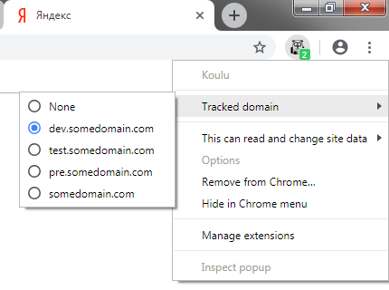

# Koulu - Google Chrome cookie tracker extension

In some cases it is necessary to copy cookies from one domain to another on scheduled basis.
For example, for development or testing purposes
This extension does it.

## Installation

You can download this extension and install it into the Chrome via "Extensions -> Load unpacked".
After that it will be available in the navigation bar.
Like this:




## Configuration

Extension can be configured via the _config.js_ file. 
You need to set some configuration variables here.

Sample config contains these lines:
```js
const CFG_COPY_TO_DOMAIN = 'localhost';
const CFG_TRACKED_COOKIES = ['JSESSIONID', 'XSRF-TOKEN'];
const CFG_TRACKED_DOMAINS = [
    'dev.somedomain.com',
    'test.somedomain.com',
    'pre.somedomain.com',
    'somedomain.com'
];

const CFG_TRACKED_PING_URL = 'https://${DOMAIN}/api/ping';
```

And imagine that you have selected *dev.somedomain.com* in the menu.
It means that *JSESSIONID* and *XSRF-TOKEN* cookies 
periodically (every minute) 
will be copied from the *dev.somedomain.com* to the *localhost*.

### Config options
- `CFG_COPY_TO_DOMAIN` - The domain to write cookies to.
- `CFG_TRACKED_DOMAINS` - List of domains to read cookies from. 
Menu items are based on this list, and only one domain at a time can be selected.
- `CFG_TRACKED_COOKIES` - List of cookie names to copy.
- `CFG_TRACKED_PING_URL` - In some cases it is necessary sometimes to ping the server from where you are reading cookies 
(to prolong user session, to health-check/heart-beat, or just to refresh cookies).
You can specify the URL in this variable. Set it to `null` if you don't need to do such pings.


## Permissions

In the _manifest.json_ you need specify URL patterns for all domains you are going to work with.
Replace "somedomain.com" and "localhost" with your actual domains in the `permissions` section.
These permissions are necessary to allow the extension to read and write cookies. 

```json
{
  "permissions": [
    "*://*.somedomain.com/",
    "*://localhost/"
  ]
}
``` 